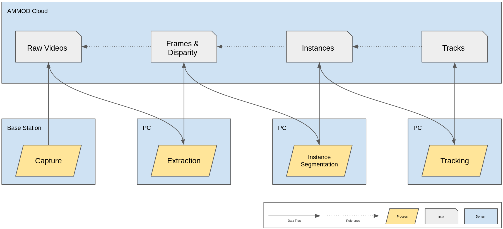

# AMMOD Interface

This is the interface of AMMOD Module 2.3 to the AMMOD API. This document serves as high-level documentation of this interface. Low-level documentation can be found in the respective source files. The goals of this interface is to:
* upload raw data files from the sensor to the AMMOD API
* process the raw data into higher-level information
* be as generic, extensible and maintainable as possible

This document should be read in conjunction with the [AMMOD schema documentation](https://gitlab.gwdg.de/gfbio/ammod-examples-schemas/) and [AMMOD API documentation](https://ammod.gfbio.dev/swagger/index.html), and aims to use the same terminology.

## Setup Instructions

* make sure python >= 3.7 is installed
* install requirements.txt: `pip install -r requirements.txt`
* [make an account](https://ammod.gfbio.dev/oidc/authenticate/) for the AMMOD portal and notify the administrators to gain access to the API
* copy `api_config.example.json` to `api_config.json` and insert your API credentials
* for any processing step inside `steps/` that requires addition model weight files not stored inside the repository, download the corresponding weights

## Architecture and Dataflow

 

The goal of this interface is to process the raw data from the sensors into higher-level information. As discussed with and desired by Module 7, each processing step should be as fine-grained as possible and intermediate results should also be stored inside the AMMOD cloud. This will allow other researchers to "enter" at any stage in the processing pipeline and do their own experiments without worrying about the previous processing steps. Data duplication (e.g. between the raw videos in step 1 and extracted frames in step 2) is accepted. Each processing step therefore takes the result(s) of previous processing steps, processes the data and uploads its results back to the AMMOD cloud. The capture process (`upload_raw.py`) is an exception, as it runs on the sensors / base station in the field and has no prior processing steps. All other processing steps are implemented in subdirectories of the `steps` directory. Each step has a corresponding Dockerfile, which is built into a docker image by `build_dockerfiles.py`. Packaging all dependencies of the respective step inside docker images will allow us at some later point in time to run all processing steps on-demand inside the AMMOD cloud and automate the whole processing pipeline. At this time, each processing step is triggered manually on manually selected input data, and runs on the current computer as the cloud processing capability is not yet implemented by Module 7. A processing step is triggered as follows: `python process.py $STEP $INPUT1 $INPUT2 ... $INPUTN`. A single step therefore takes `N` inputs, which are specified as metadata record IDs. The corresponding files are then downloaded via the AMMOD API and passed to the step's docker container at `/tmp/in`. The process inside the docker container then outputs files into `/tmp/out`, which are subsequently automatically uploaded via the AMMOD API.

## Issues

The following list gives a quick overview over current issues and leftover tasks:

* the AMMOD API runs on relatively weak staging hardware and therefore times-out sometimes, making it difficult to upload large files. Currently, the only solution is to retry the respective processing step
* it is not possible to upload files with a `.json` file extension, as those files are confused with the metadata. Therefore, processes should extend such filenames with a `.txt` extension
* processes have to be triggerred and input metadata record IDs have to be found manually. Ideally, this will be fully automated once cloud processing is implemented by Module 7